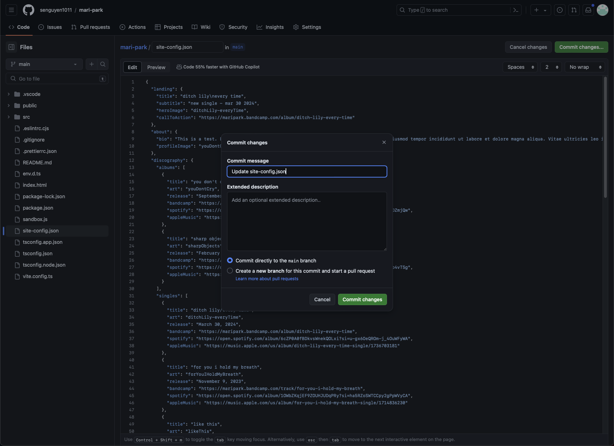
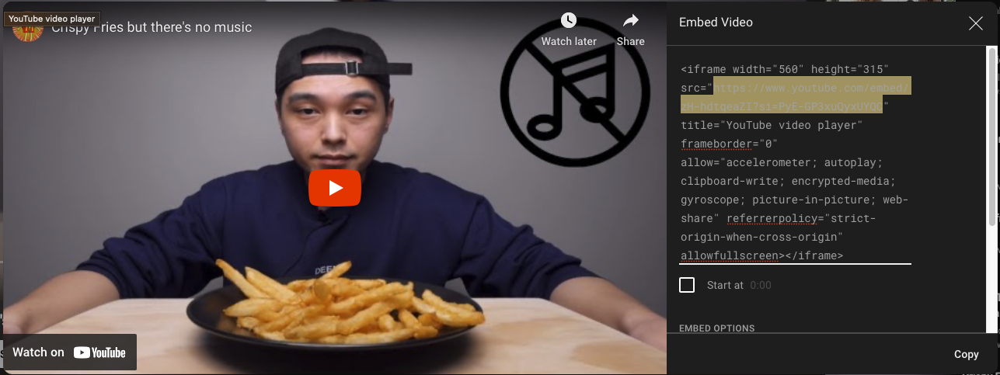

# mari-park

## Site Config Guide

The site will have editable config that is set in `site-config.json`. JSON files are an easy way to scaffold and represent data, and the way it is formatted is the data is enclosed in curly brackets (`{...}`) and each property in JSON is specified by a key and a value. The key will always be surrounded by quotation marks and followed by a colon, which is then followed by the value, that of which can be different types of data (`"key": "I'm a value!"`). In this case, all values are strings, which means they _must_ be surrounded by quotation marks. All properties are followed by a comma except for the last property. If you mess up any of this formatting, don't worry, just let me know and I'll find the problem and fix it. If you ever need an example, refer to `site-config-EXAMPLE.json`. To edit, click on the edit button when in the `site-config.json` file, make your edits, and click on the "Commit changes..." button.

The menu will look like the following, and you want to make sure the option "Commit directly to the main branch" is checked. Commit your changes, wait a few seconds, and your changes will be deployed.

### Images

You can upload images in the `public/images/` directory. All these images are expected to be in a `.jpg` format. You can name the images whatever you'd like, but it'll be easiest if the image name does not have any spaces in it. To add a file, click on the "Add file" button once you're in the `public/images/` directory, and click "Upload files". Which in that case you can upload your `.jpg` files. Once you've chosen your files, click on "Commit changes".

## Landing

- ["title"]: This is the big text on the top of the page
- ["subtitle"]: This is the little text that supplements the top of the page.
- ["heroImage"]: Name of the image that's represented on the top of the page. The image specified will also be the blurred background for the landing section.
- ["callToAction"]: The button at the top of the page's link.

## About

- ["bio"]: Your biography or whatever you'd like to put in here.
- ["profileImage"]: The name of the image that's represented in the about section.

## Discography

The discography is split into 3 properties, `"albums"`, `"singles"`, and `"features"`. Each of these properties' values are lists of objects, which are all the same except for `"features"`, which has an extra `"artists"` property. If you'd like to add another album or single, just add another object to the appropriate list with the following properties:

- ["title"]: Title of the release.
- ["art"]: Name of the image that represents the release.
- ["release"]: Release date.
- ["bandcamp", "spotify", "appleMusic"]: Links to the respective streaming sites.
- ["artists"]: For featured releases only, a list of the artists on the release.

If you're adding a new release, make sure you remember to add a comma at the end of the object since these are kept in lists!

## Videos

On YouTube, there is a button to share a video. One of the sharing options is embed, which we use for this site! The embed menu looks like the following:

Our config is _only_ concerned with the highlighted portion in this image, the `src` of the embed.

- ["videos"]: A list of embed links from YouTube.

## Events

It is possible to have 0 events, in which case, the event list will be an empty list (`"events": [],`)

- ["date"]: The date of an event.
- ["location"]: The location of an event.
- ["venue"]: The venue of an event.
- ["path"]: The link to more event information.

## Socials

- ["site"]: The name of the social site.
- ["icon"]: The name of the representative icon, ignore this.
- ["path"]: The link to the social site.
- ["contactEmail"]: Your email, which will be used when clicked on the contact button.
